# Serverless Language Translator Web Application

## Overview

In this project, I built a language translation web application on AWS where authenticated users can translate text into multiple languages, store translations, and manage their translation history through a React frontend that communicates with a serverless backend API.

The application follows key cloud-native principles:
-   Serverless architecture
-   JSON Web Token (JWT) based authentication
-   Event-driven compute
-   Scalable NoSQL data storage
-   Fully managed cloud services

Live Demo: [Open Application](https://staging.d1hghdci4s4bn3.amplifyapp.com)
**Note**: You will need to create an account to access the application.
    
----------

## High-Level Architecture

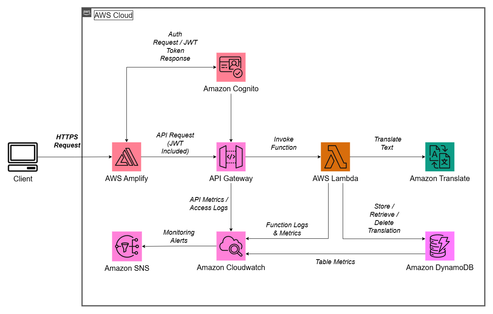

1. A user accesses the React application hosted on AWS Amplify.
2. The user authenticates through Amazon Cognito.
3. The frontend sends authenticated requests to Amazon API Gateway.
4. API Gateway routes authorized requests to the appropriate AWS Lambda function.
5. The Lambda function processes the request (translation, history retrieval, or deletion), interacting with Amazon Translate and Amazon DynamoDB as needed.
6. The response is returned to the frontend and displayed to the user.
7. Application logs and metrics are captured in CloudWatch, with alerts sent via SNS when necessary.

----------

## AWS Services Used

-   **AWS Amplify** – Hosting the React frontend
-   **Amazon Cognito** – User authentication and JSON Web Token (JWT)
-   **Amazon API Gateway** – Secure API endpoints
-   **AWS Lambda** – Backend processing logic
-   **Amazon Translate** – Language translation service
-   **Amazon DynamoDB** – Storage for translation history
-   **AWS Identity and Access Management (IAM)** – Access control and service permissions
-   **Amazon CloudWatch** – Application monitoring, metrics, and logs  
-   **Amazon Simple Notification Service (SNS)** – Alert notifications for monitoring alarms
    
----------

## How This Was Built


### 1. Create DynamoDB Table

A DynamoDB table was created to store translation records for each authenticated user.

The table uses a composite primary key designed for efficient per-user queries:

Partition Key:  ```user_id```
Sort Key: ```timestamp```

Each record also includes:
```
originalText
translatedText
language
```
This structure groups each user's translations together while allowing efficient chronological queries using the sort key.

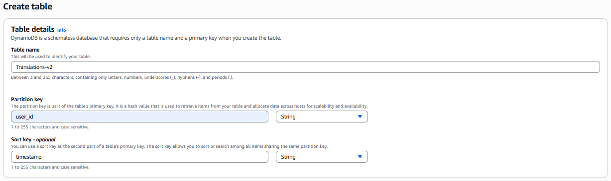

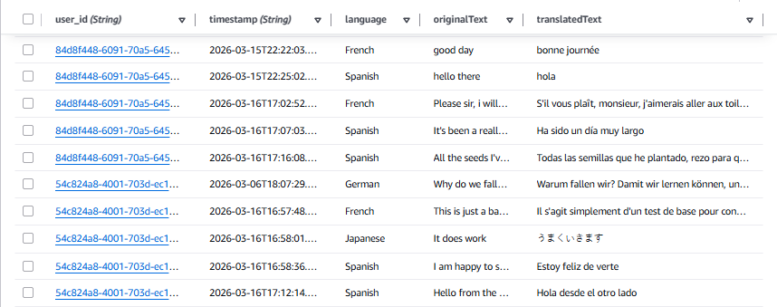

----------

### 2. Build Lambda Functions

Three Lambda functions were built to handle the backend logic. Each function serves a specific purpose:
-   Translating user input
-   Retrieving translation history
-   Deleting history entries

The translation function integrates with Amazon Translate to perform language translation and then stores the result in DynamoDB.

The history retrieval function queries DynamoDB to return all translation records associated with the authenticated user. It uses the table's partition key to retrieve the items ordered by timestamp in descending order, allowing the frontend to display the user's translation history.

The deletion function removes a specific translation record from DynamoDB. It identifies the record by using the table's composite primary key, ensuring that users can only delete entries belonging to their own history.

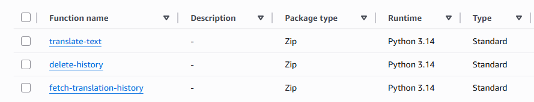    

Together, these Lambda functions provide the core backend functionality for translation processing, history retrieval, and record management.

Lambda automatically scales with incoming requests, allowing the application to handle varying workloads without manual intervention.

----------
### 3. Configure Authentication with Cognito

Amazon Cognito was configured to manage user authentication and identity for the application.

A Cognito User Pool was created to allow users to securely register and authenticate. Through this service, users can sign up for an account, sign in to the application, and sign out of their session.
    
After successful authentication, Cognito generates a JSON Web Token (JWT) that represents the authenticated user session.

The React frontend will retrieve this token after login and store it temporarily for inclusion in API requests. When the frontend communicates with the backend services, it includes the token in the authorization header of each request.

This token allows the system to identify the authenticated user and ensures that only logged-in users can interact with the application's backend services.

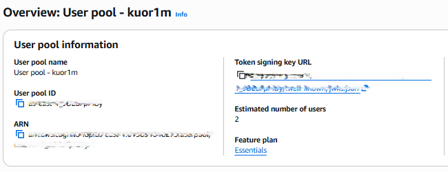

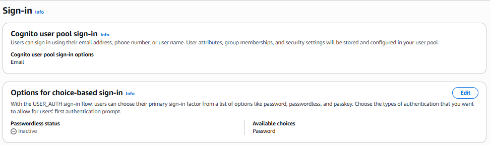

----------

### 4. Create API Gateway

Amazon API Gateway was configured to expose the backend functionality through HTTP endpoints and act as the entry point for all requests coming from the frontend.

The following endpoints were created:

```
POST /translate
GET /history
DELETE /history/{id}
```
Each endpoint integrates with a corresponding Lambda function that handles the business logic.

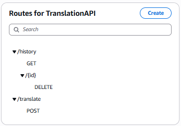

Authentication is handled via Amazon Cognito (as described in the previous section), with API Gateway enforcing access using a JWT authorizer.

Once authenticated, requests are routed to Lambda, where the user identity from the request context is used to perform operations on DynamoDB.

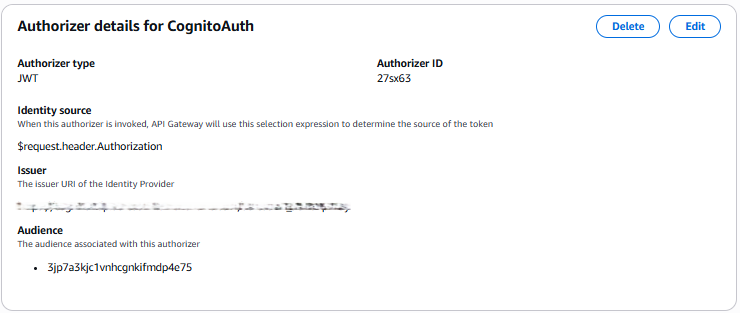

----------

### 5. Build the React Frontend

A React application was developed locally to provide the user interface.

The frontend allows users to:

-   Enter text for translation
-   Select a target language (English, French, Spanish, German, or Japanese)
-   View translated output  
-   View translation history
-   Delete previous translations
    
The application communicates with backend APIs using HTTP requests.

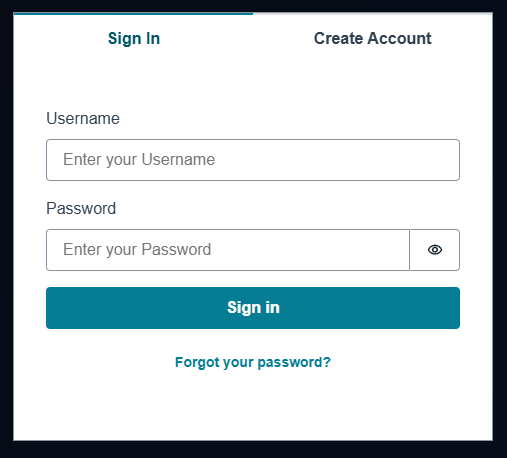

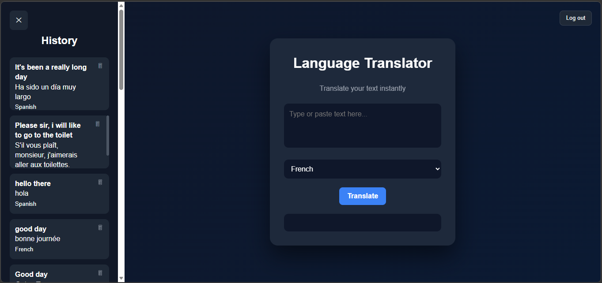

----------

### 6. Deploy the Frontend with Amplify

The React application was deployed using AWS Amplify Hosting.

Amplify provides:

-   Managed frontend hosting
-   Global CDN delivery
-   Simple deployment workflow
-   Secure HTTPS access
    
Users access the web application directly through the Amplify-hosted frontend.

----------

### 7. Monitoring and Observability

Application monitoring is handled using Amazon CloudWatch and Amazon SNS to track system health and notify administrators when issues occur.

CloudWatch collects logs and metrics from key services in the architecture:

-   API Gateway – request count, latency, and error rates
-   AWS Lambda – function invocations, execution duration, and errors
-   Amazon DynamoDB – table read/write activity and throttling metrics
    
These metrics are visualized through a monitoring dashboard, providing a centralized view of system performance and operational activity.

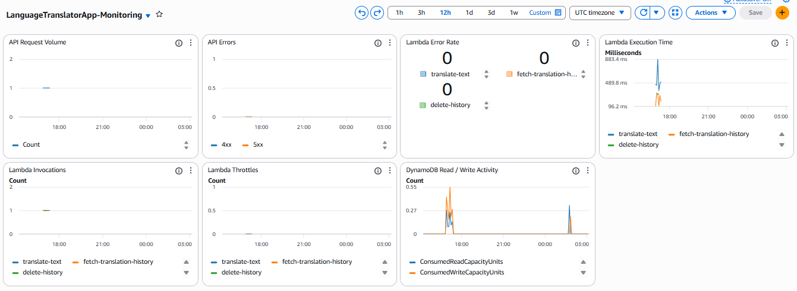

CloudWatch alarms are configured to detect issues such as Lambda errors, high latency, and API Gateway failures.

When thresholds are exceeded, notifications are sent via SNS, enabling quick response to potential problems.

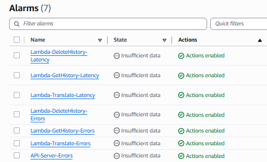

----------

## Key Design Decisions

- Serverless backend using AWS Lambda and managed services
- JWT-based authentication with Amazon Cognito to secure API access
- DynamoDB schema designed with a partition key (`user_id`) and sort key (`timestamp`) for efficient per-user queries
- Separation of frontend and backend layers to improve scalability and maintainability
    
----------

## What This Project Demonstrates

- Designing and building a full-stack serverless application on AWS  
- Implementing secure authentication and authorization using JWT  
- Integrating multiple AWS services within a cloud-native architecture  
- Designing scalable NoSQL data models using DynamoDB  
- Building and integrating a React frontend with a serverless backend  
- Implementing monitoring and alerting using CloudWatch and SNS

----------

## Conclusion

This project shows how a full-stack serverless web application can be built using AWS managed services.  
  
By combining frontend hosting, secure authentication, and managed backend services, the system remains cost-efficient and easy to maintain. 
  
The same architectural pattern can be applied to many real-world applications, including chatbots, content translation services, and multilingual communication platforms.

----------
